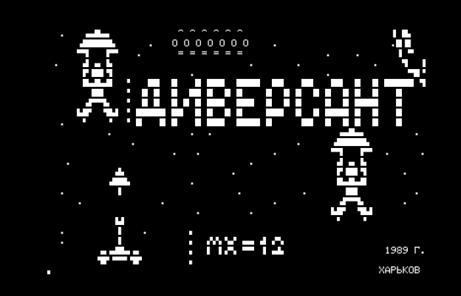
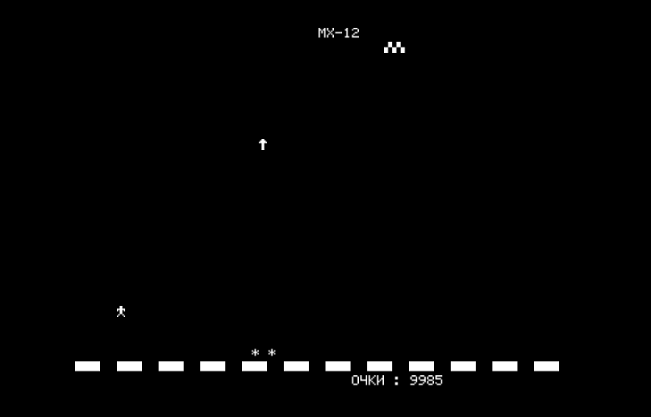

# diverse

Reverse-engineered Intel 8080 source for **ДИВЕРСАНТ** ("Diversant" /
"Saboteurs"), a ≈6 KB arcade-style shoot-the-paratroopers game for the
Радио-86РК (Radio-86RK) home computer. The original binary is
preserved as `tape/DIVERSE.GAM`; `diverse.asm` reassembles to that
exact byte stream under `just ci`.





## Play it in your browser

No emulator install required — the `rk86.ru` web emulator can load the
tape file directly from this repo:

<https://rk86.ru/beta/index.html?run=DIVERSE.GAM>

Keys (matches the "instructions" screen inside the game):

- **←  →  ↑  ↓** — move the MX-12 anti-air platform
- **Space** — fire a torpedo
- **АР2** (emulator: usually mapped to `F5`) — pause
- **СТР** (emulator: usually `F6`) — clear screen / hard restart
- **Ctrl-C** — return to the RK86 monitor

Main-menu letters:

- **N** (`Н`ачать) — start a new game
- **U** (`У`ровень) — cycle difficulty (ЛЕГКИЙ / СРЕДНИЙ / ТЯЖЕЛЫЙ)
- **I** (`И`нструкция) — show the full instructions screen

## Purpose — educational, not commercial

This project exists **purely for historical preservation and
educational value**. The Radio-86РК was a widely-cloned Soviet-era
hobbyist computer built from the open schematics published in the
magazine *Радио* in 1986, and games like *ДИВЕРСАНТ* were shared
hand-to-hand on cassette tape. The goal of this repository is to:

- **Preserve** the original binary (`tape/DIVERSE.GAM` is the
  untouched tape dump — do not modify).
- **Explain** how an early-80s-era assembly programmer laid out a
  complete game under ~6 KB, using the RK86 monitor ROM, the К580ВГ75
  CRT controller, video-RAM glyph codes, and self-modifying code for
  everything from per-difficulty tuning to the main frame-delay loop.
- **Document** the hardware idioms (RK86 character set, keyboard
  matrix, ESC-Y cursor positioning, tape format) that the game relies
  on, with cross-references to the authoritative monitor-ROM source.

No effort has been made to port the game to any modern platform or to
redistribute its binary outside this educational context. Users who
enjoy the game are encouraged to support the Radio-86РК emulator
community at <https://rk86.ru/>.

## Author & rights

*ДИВЕРСАНТ* appears to have been written by an author from **Харьков
(Kharkov/Kharkiv)** — the city name is rendered as an in-game signature
on the bottom row of the playfield (visible in the patch table near
the end of `diverse.asm`, and on screen as the row 27 text). The
original author is unknown to this project; if you know who they are,
a pull request adding attribution is welcome.

Copyright in the original binary remains with its author. This
reverse-engineered source is published under the terms of the
`LICENSE` file in this repository for **research, study, and
teaching** purposes only. Any redistribution that goes beyond these
purposes should obtain the author's permission.

## Repo layout

```text
diverse.asm          reverse-engineered i8080 source
tape/DIVERSE.GAM     original tape dump (preserved verbatim)
diverse.gam          build output; byte-identical to tape/DIVERSE.GAM
Justfile             `just ci`  = build + compare to tape
disasm.py            small linear i8080 disassembler used during reversing
CLAUDE.md            notes collected during reversing (hardware idioms,
                     SMC patterns, difficulty table)
diverse-splash.png   boot screen
diverse-game.png     gameplay screenshot
```

## Building

```sh
just ci     # assembles diverse.asm, diffs against tape/DIVERSE.GAM
```

The toolchain is [`asm8080`](https://github.com/begoon/asm8) (browser +
CLI Intel 8080 assembler, available on npm as `asm8080`), invoked via
`bunx`. Any change that leaves `diverse.gam` byte-identical to
`tape/DIVERSE.GAM` is safe — `just ci` will report no diff.

## Further reading

- RK86 programmer's reference:
  [`RK86.md`](https://github.com/begoon/rk86-js-kit/blob/main/info/RK86.md) — memory
  map, peripherals, character set, monitor jump table, tape format.
- Monitor ROM source:
  [begoon/rk86-monitor](https://github.com/begoon/rk86-monitor) — the
  `F800h..FFFFh` code this game calls into ([online](https://rk86.ru/monitor))
- Notes gathered while reversing: [`CLAUDE.md`](CLAUDE.md) — К580ВГ75
  SCN4 decoding, self-modifying difficulty table, `FD27h` sound entry
  point, and other patterns encountered in the binary.
